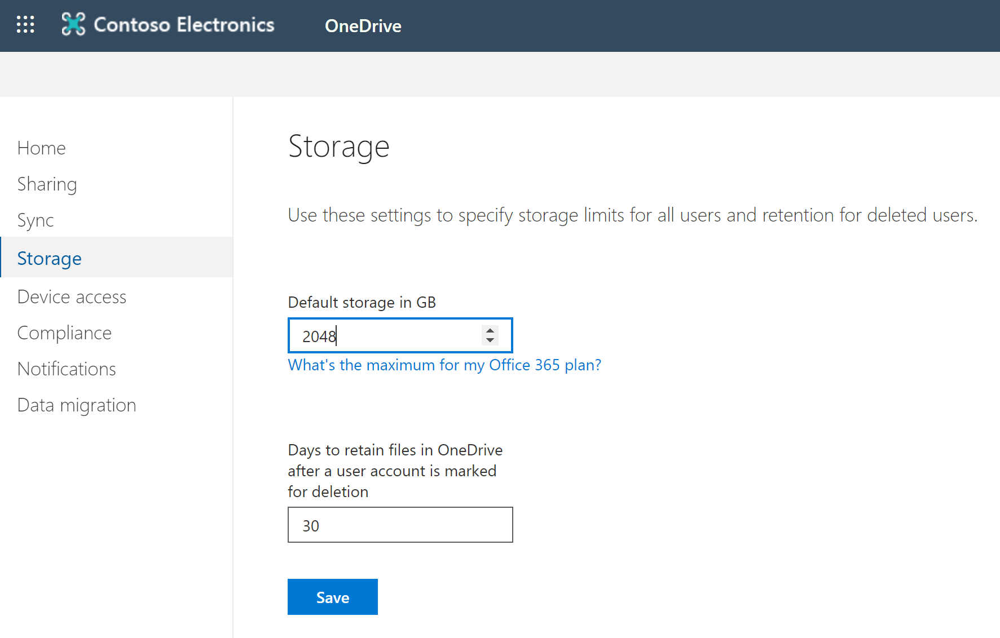
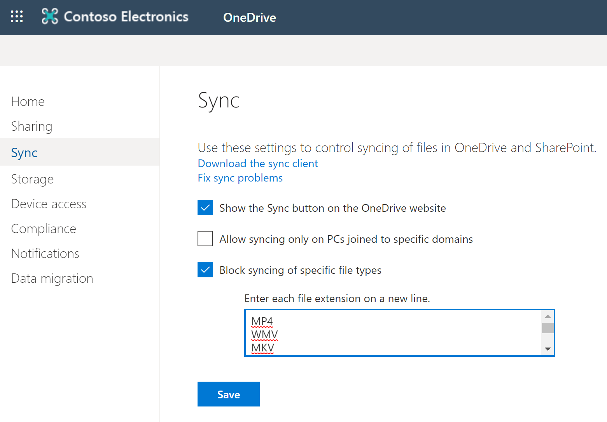
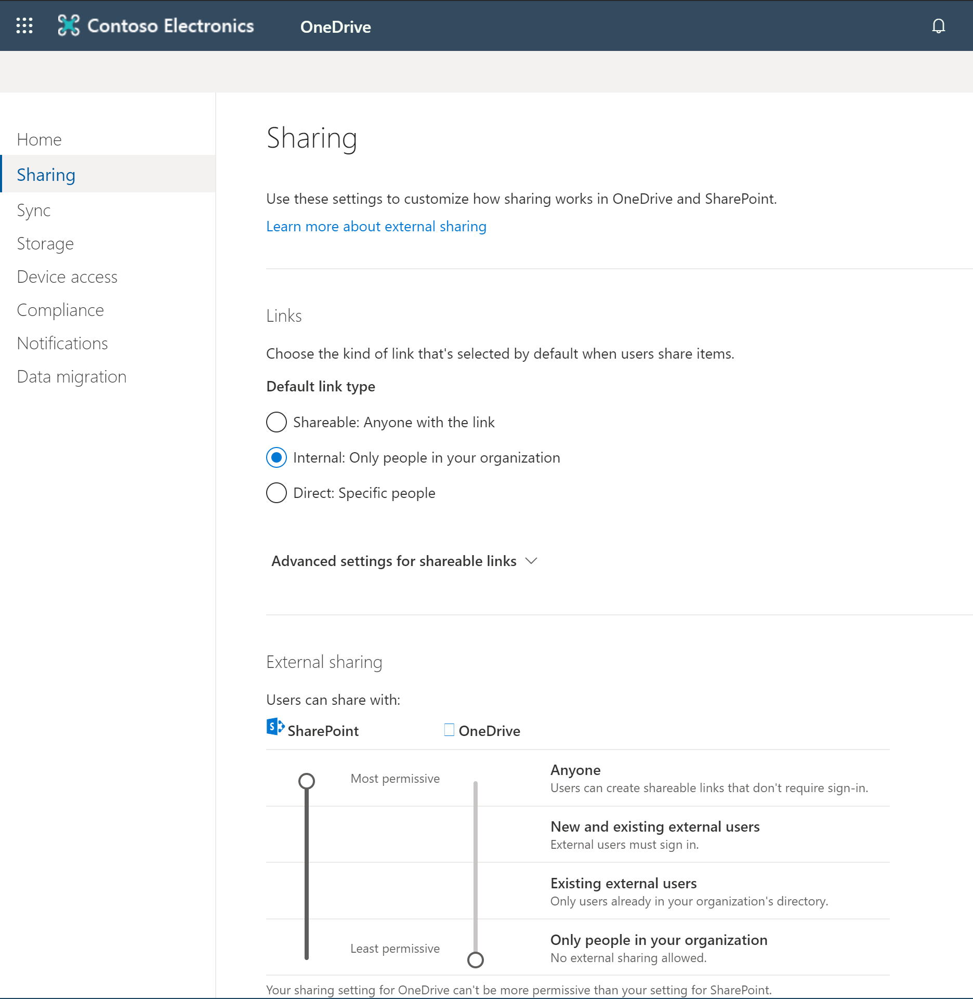

# Module 02-Lab 1: Manage OneDrive
## Microsoft 365 user interface 

Given the dynamic nature of Microsoft cloud tools, you may experience user interface (UI) changes that were made following the development of this training content. This will manifest itself in UI changes that do not match up with the detailed instructions presented in this lab manual.

The Microsoft World-Wide Learning team will update this training course as soon as any such changes are brought to our attention. However, given the dynamic nature of cloud updates, you may run into UI changes before this training content is updated. **If this occurs, you will have to adapt to the changes and work through them in the lab exercises as needed.**

## Lab Scenario 

You are the SharePoint Administrator for Adatum Corporation. The company wants to block certain file types been synced and restrict users to share files in OneDrive with people outside the organization. In the labs of this module, you will configure certain aspects of the OneDrive sync app and set service parameters in the OneDrive admin center.

- **Exercise 1: Manage OneDrive settings**

  - Task 1: Set storage quota for all users

  - Task 2: Restrict file types from being synced

  - Task 3: Set sharing limits

## Objectives

After you complete this lab, you will be able to:

  - Set storage quota for all users

  - Limit certain file types from syncing

  - Configure limits on sharing

## Lab Setup 

  - **Estimated Time:** 30 minutes.

## Instructions

### Before you start

### 1. Review the lab virtual machines

The following is the virtual machine provided in this course. You will log in to the VM as a local administrator. The instructor will provide the sign-in information.

  - VM 1: a stand-alone Windows 10 client virtual machine with Office 2019 installed.

### 2. Review Microsoft 365 tenant

Once you launch the VM, a free trial tenant will be made available to you. The following are the details about the Microsoft 365 tenant:

  - Microsoft 365 E5.

  - 20 licenses and pre-assigned (20 assigned of 20 total).

  - One Global Administrator (MOD Administrator) and nineteen normal users have been pre-created.

  - Global Administrator (MOD Administrator) is **admin@YourTenant.onmicrosoft.com**.

**Note:** **YourTenant**.onmicrosoft.com is the domain associated with the Microsoft 365 tenant provided by the lab hosting provider. **YourTenant** is the unique tenant ID and different to each student.

## Exercise 1: Manage OneDrive settings 

In this exercise you will complete multiple administrative tasks. You will assign all users to have a storage limit of 2TB, restrict certain file types from being synced and set limits on sharing. These administrative changes would be done typically prior to roll out of the sync app to users.

### Task 1: Set storage quota for all users

In this task, you will check the current storage quota for all users and then change to 2TB.

1.  Log on to **LON-CL1** virtual machine as the local administrator (Adatum\\administrator).

2.  Open **Edge** and browse to <https://portal.office.com>.

3.  Sign in to Microsoft 365
    
    1.  You should be presented a sign in dialog box, if you are directed to the page instead, select **Sign In** from the upper right of the page. If you are presented the sign in dialog box, **copy and paste the M365 Credential Username** into the box presented, select **Next**.
    
    2.  In the next screen, **copy and paste the M365 Credential Password** into the box presented, select **Sign In**.
    
    3.  When it asks if you would like to **Stay signed in?** then select **Yes** to stay signed in.

4.  In the Microsoft 365 landing page, select **Admin** to access **Microsoft 365 admin center.**

5.  In the Microsoft 365 admin center, select **Show all \> All admin centers** in the left pane, and select **OneDrive** to access **OneDrive admin center (**<https://admin.onedrive.com/>)**.**

6.  Select **Storage** in the left navigation menu. This will open the storage setting page.

    

7.  Note that the current storage quota is set to 1024 GB (1 TB). Change the value to **2048**.

8.  Select the **Save** on the Storage page to confirm the changes.

You have successfully changed the storage quota for all new users to 2 TB. Continue with the next task.

### Task 2: Restrict file types from being synced 

You need to restrict the sync client so that large files such as videos are not being synced. In this task you will add restrictions so that common video file formats are not synced.

1.  From the OneDrive admin center select **Sync** in the left navigation pane. This will open the sync settings page.

2.  Select the box for **Block syncing of specific file types**.

3.  In the text box enter the file extensions as shown below. Do not enter any punctuation such as a period with the entry. Enter each on its own line.
    
    * MP4
    * WMV
    * MKV
    * MOV
    * AVI

    

4.  Select **Save** on the sync page to save the changes.

You have successfully blocked the required file formats from being sync’d with your tenant. You have finished this task and you can continue to the next one.

### Task 3: Set sharing limits

In this task you will need to set the default link type and with whom users can share externally.

1.  From the OneDrive admin center select **Sharing** in the left navigation pane. This will open the Sharing settings page.

2.  Under the Links section select **Internal: Only people in your organization**.

3.  Under the External sharing section move the slider under OneDrive to **Only people in your organization.**

    

4.  Select **Save** on the Sharing page to save the changes.

You have now successfully set the sharing controls per requirements. You have completed this exercise.

END OF LAB
