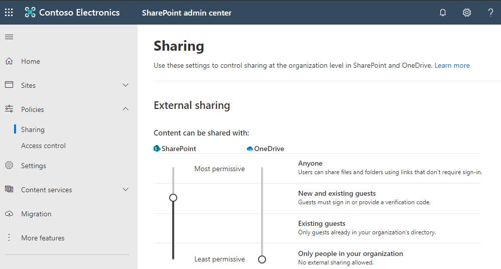
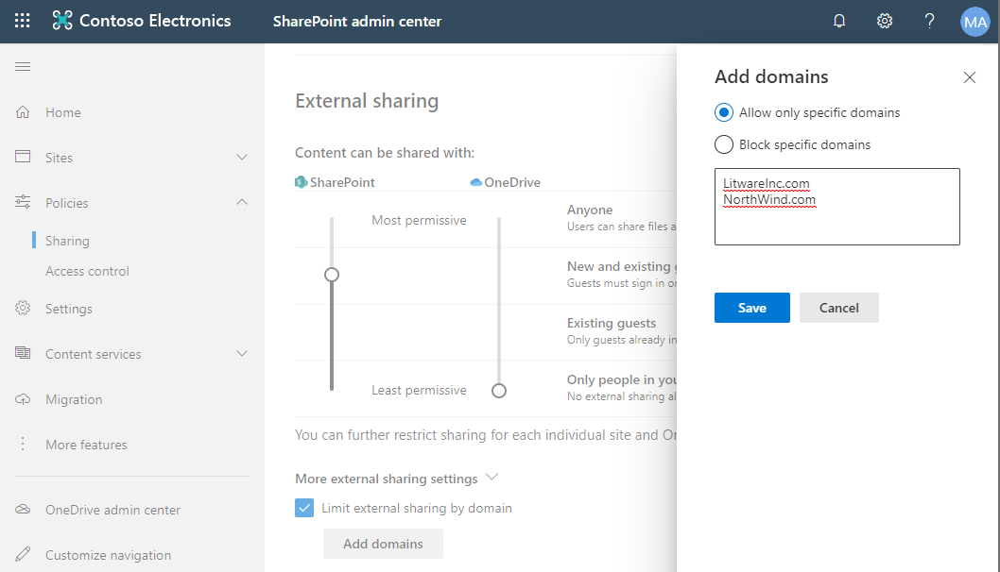
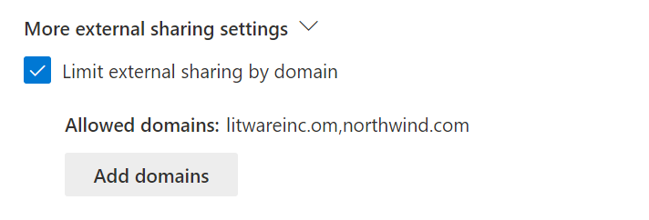

# Module 03-Lab 1: Manage sharing 

## Microsoft 365 user interface 

Given the dynamic nature of Microsoft cloud tools, you may experience user interface (UI) changes that were made following the development of this training content. This will manifest itself in UI changes that do not match up with the detailed instructions presented in this lab manual.

The Microsoft World-Wide Learning team will update this training course as soon as any such changes are brought to our attention. However, given the dynamic nature of cloud updates, you may run into UI changes before this training content is updated. **If this occurs, you will have to adapt to the changes and work through them in the lab exercises as needed.**

## Lab Scenario 

You are the SharePoint Administrator for Adatum Corporation. The company has a partnership with LitwareInc and NorthWind and requests to enable content sharing with those vendors. In this lab, you will enable external sharing and update the site permission for the US Sales site, which contains confidential content.

- **Exercise 1: Enable external sharing**

  - Task 1: Change the sharing options

  - Task 2: Limit external sharing by domain

- **Exercise 2: Manage sharing for a site**

  - Task 1: Change the sharing options for a site

## Objectives

After you complete this lab, you will be able to:

  - Allow or block sharing content from SharePoint or OneDrive

  - Customize sharing settings for a site

## Lab Setup 

  - **Estimated Time:** 30 minutes.

## Instructions

### Before you start

### 1. Review the lab virtual machines

The following is the virtual machine provided in this course. You will log in to the VM as a local administrator. The instructor will provide the sign-in information.

  - VM 1: a stand-alone Windows 10 client virtual machine with Office 2019 installed.

### 2. Review Microsoft 365 tenant

Once you launch the VM, a free trial tenant will be made available to you. The following are the details about the Microsoft 365 tenant:

  - Microsoft 365 E5.

  - 20 licenses and pre-assigned (20 assigned of 20 total).

  - One Global Administrator (MOD Administrator) and nineteen normal users have been pre-created.

  - Global Administrator (MOD Administrator) is **admin@YourTenant.onmicrosoft.com**.

**Note:** **YourTenant**.onmicrosoft.com is the domain associated with the Microsoft 365 tenant provided by the lab hosting provider. **YourTenant** is the unique tenant ID and different to each student.

## Exercise 1: Enable external sharing

In this exercise, you will enable external sharing to the user in the following domains for the new partnership:

* LitwareInc.com
* NorthWind.com

### Task 1: Change the sharing options

1.  Log on to **LON-CL1** virtual machine as the local administrator (Adatum\\administrator).

2.  Open **Edge** and browse to SharePoint admin center (https://\<YourTenant\>-admin.sharepoint.com) with your Microsoft 365 admin credential.

3.  Expand **Policies** and select **Sharing.**

4.  Under the External sharing section move the slider under SharePoint to **New and existing guests.**

5.  Expand **More external sharing settings.**

    

### Task 2: Limit external sharing by domain

1.  From the SharePoint admin center, expand **Policies** and select **Sharing.**

2.  Under **External sharing** section, expend **More external sharing settings.**

3.  Select **Limit external sharing by domain.**

4.  Select **Add domains** button.

5.  In the new window, select **Allow only specific domains.**

6.  Enter the following domains in the text box and select **Save.**

    LitwareInc.com
    
    NorthWind.com

    

7.  You will see the allowed domains updated in the SharePoint admin center.

    

8.  Scroll down to the bottom of the settings page and select **Save.**

## Exercise 2: Manage sharing for a site

In this exercise, you will update the sharing settings for the US Sales site to protect the confidential data being shared with people outside the organization.

### Task 1: Change the sharing options for a site

1.  Log on to **LON-CL1** virtual machine as the local administrator (Adatum\\administrator).

2.  Open **Edge** and browse to SharePoint admin center (https://\<YourTenant\>-admin.sharepoint.com) with your Microsoft 365 admin credential.

3.  Expand **Sites** and select **Active sites.**

4.  Select the **U.S. Sales site (**<https://YourTenant.sharepoint.com/sites/USSales>).

5.  In the new window, select **Policies** tab.

6.  Select **Edit** under External sharing.

7.  In the new window, select **Only people in your organization.**

8.  Select **Save.**

 END OF LAB
