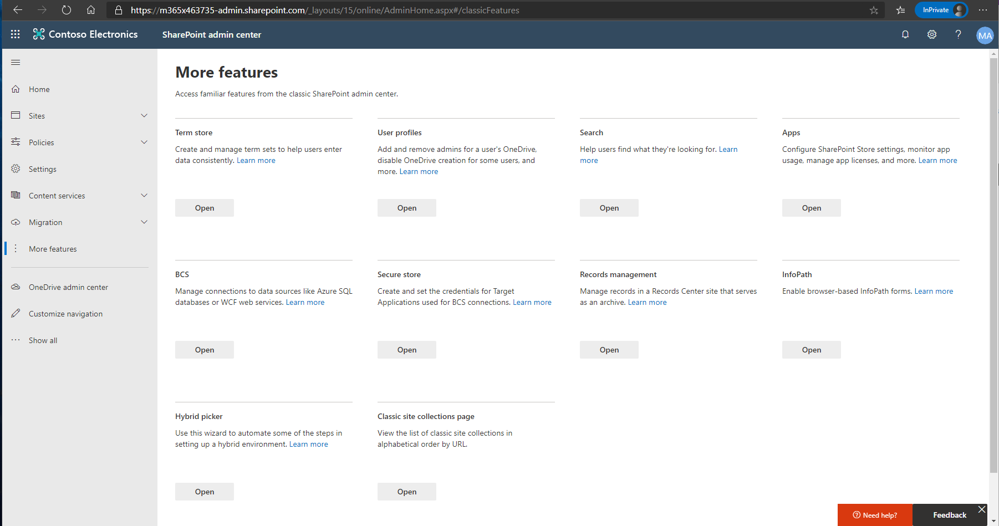
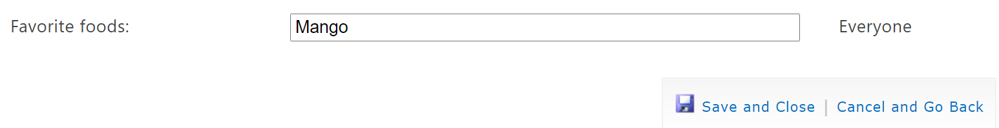
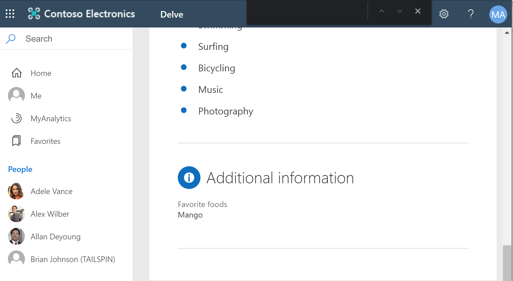

# Module 04-Lab 1: Manage User Profiles and Apps

## Microsoft 365 user interface 

Given the dynamic nature of Microsoft cloud tools, you may experience user interface (UI) changes that were made following the development of this training content. This will manifest itself in UI changes that do not match up with the detailed instructions presented in this lab manual.

The Microsoft World-Wide Learning team will update this training course as soon as any such changes are brought to our attention. However, given the dynamic nature of cloud updates, you may run into UI changes before this training content is updated. **If this occurs, you will have to adapt to the changes and work through them in the lab exercises as needed.**

## Lab Scenario 

In the labs of this course you will need to add a custom property to the SharePoint User Profile service and edit a property. You will also need to configure an app catalog for the tenant.

- **Exercise 1: Manage user profiles**

  - Task 1: Create a custom user profile property
  - Task 2: Edit a user profile property

- **Exercise 2: Manage apps**

  - Task 1: Create an App Catalog site

## Objectives

After you complete this lab, you will be able to:

  - Create custom user properties

  - Edit the value for a user profile property

  - Create a new app catalog for a tenant

## Lab Setup 

  - **Estimated Time:** 40 minutes.

## Instructions

### Before you start

### 1. Review the lab virtual machines

The following is the virtual machine provided in this course. You will log in to the VM as a local administrator. The instructor will provide the sign-in information.

  - VM 1: a stand-alone Windows 10 client virtual machine with Office 2019 installed.

### 2. Review Microsoft 365 tenant

Once you launch the VM, a free trial tenant will be made available to you. The following are the details about the Microsoft 365 tenant:

  - Microsoft 365 E5.

  - 20 licenses and pre-assigned (20 assigned of 20 total).

  - One Global Administrator (MOD Administrator) and nineteen normal users have been pre-created.

  - Global Administrator (MOD Administrator) is **admin@YourTenant.onmicrosoft.com**.

**Note:** **YourTenant**.onmicrosoft.com is the domain associated with the Microsoft 365 tenant provided by the lab hosting provider. **YourTenant** is the unique tenant ID and different to each student.

## Exercise 1: Manage user profiles

In this exercise you will create a custom property that will be applied to user profiles in the tenant.

### Task 1: Create a custom user profile property

1.  Log on to **LON-CL1** virtual machine as the local administrator (Adatum\\administrator).

2.  Open **Edge** and browse to SharePoint admin center (https://\<YourTenant\>-admin.sharepoint.com) with your Microsoft 365 admin credential.

3.  In the left navigation pane, select **More features**. The More features landing page will be presented.

    

4.  In the More features page, select **Open** under **User Profiles**. You will now be on the User Profiles management page.

5.  Select **Manage User Properties.**

6.  Select **New Property** to open the new property page.

7.  Fill out the following property information and select **OK** to complete the creation.

    - **Name:** Favorite foods
    - **Display Name:** Favorite foods
    - **Type:** String
    - **Policy Settings:** Optional
    - **Default Privacy Setting:** Everyone
    - Select **User can override**
    - Select **Allow users to edit values for this property**
    - Select **Show in the profile properties section of the user's profile page**
    - Select **Show on the Edit Details page**
    - Select **Show updates to the property in newsfeed**
    - Leave other settings as default

You have successfully created a new user profile property that is now available to all users.

### Task 2: Edit a user profile property

1.  Log on to **LON-CL1** virtual machine as the local administrator (Adatum\\administrator).

2.  Open **Edge** and browse to SharePoint admin center (https://\<YourTenant\>-admin.sharepoint.com) with your Microsoft 365 admin credential.
3.  In the left navigation pane, select **More features**.

4.  In the More features page, select **Open** under **User Profiles**. You will now be on the User Profiles management page.

5.  Select **Manage User Profiles.**

6.  Ender **Adele Vance** in the Find profiles text box and select **Find.**

7.  Select on the search result of the user and select **Edit my profile.**

8.  In the edit profile page, scroll to the bottom of the page and locate the custom property (Favorite foods) just created.

9.  Type **Mango** in the text box and select **Save and Close.**

    

10. You can browse to **Adele Vance’s** profile page and see the new profile property show up in the page.

    

You have now completed the actions of modifying the user’s profile. This update will now be visible to people when searching for and viewing the user’s profile.

## Exercise 2: Manage apps

In this exercise you will create a new App Catalog site that will be used by the tenant. This will permit users to be able to install custom apps.

### Task 1: Create an App Catalog site

1.  Log on to **LON-CL1** virtual machine as the local administrator (Adatum\\administrator).

2.  Open **Edge** and browse to SharePoint admin center (https://\<YourTenant\>-admin.sharepoint.com) with your Microsoft 365 admin credential.

3.  In the left navigation pane, select **More features**.

4.  In the More features page, select **Open** under **Apps**.

5.  Select **App Catalog.**

6.  Select **Create a new app catalog site** and select **OK**.

7.  Fill out the following site information and select **OK** to complete the creation.
    
      - **Title:** App Catalog
    
      - **Web Site Address:**
    
      - **Administrator:** admin@\<YourTenant\>.onmicrosoft.com

You have now successfully created a new app catalog for your tenant. You have finished this exercise.

END OF LAB
