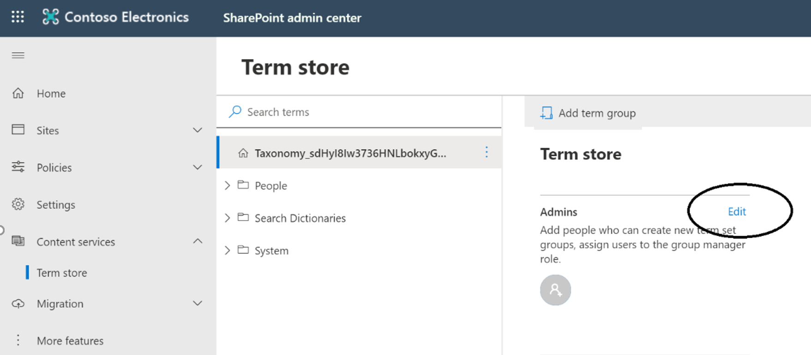
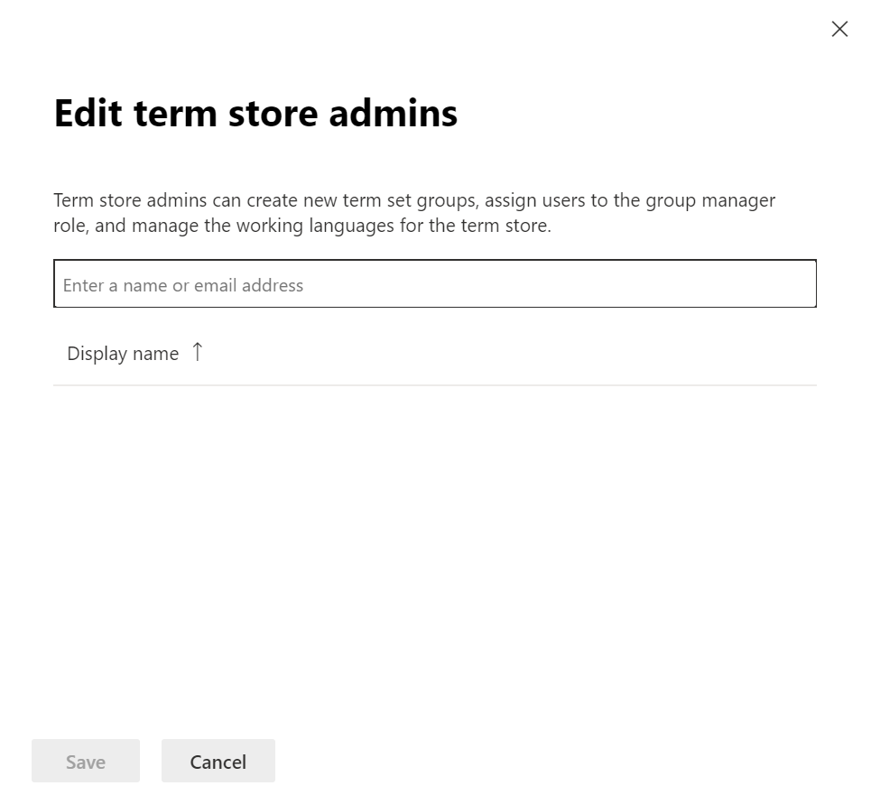
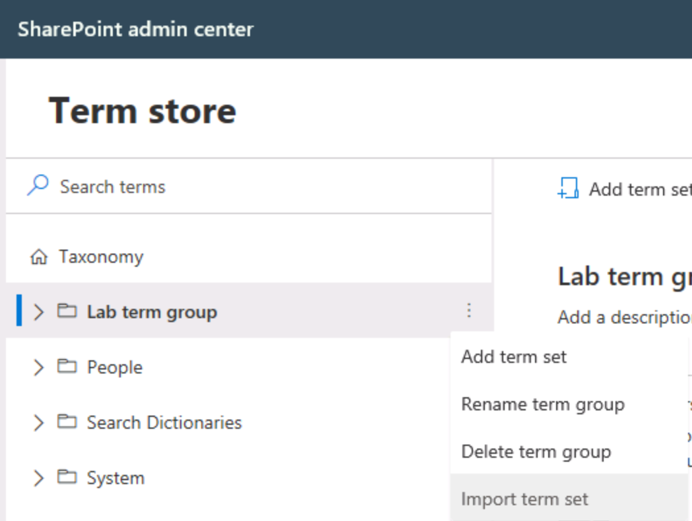
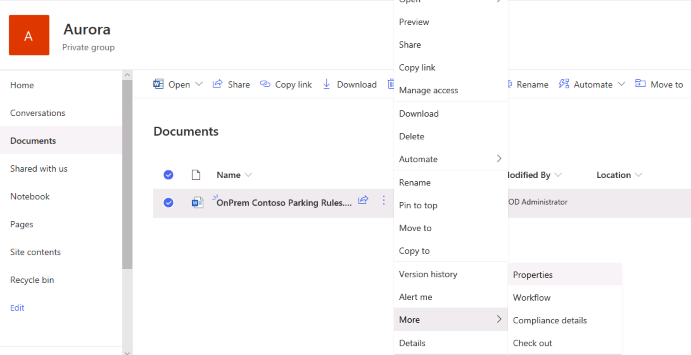
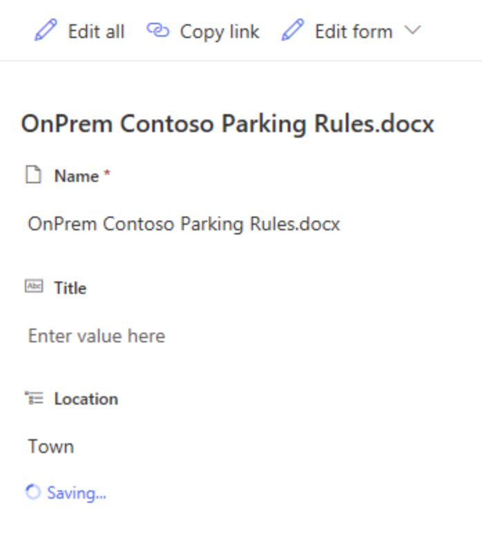

# Module 05-Lab 1: Manage term set

## Microsoft 365 user interface 

Given the dynamic nature of Microsoft cloud tools, you may experience user interface (UI) changes that were made following the development of this training content. This will manifest itself in UI changes that do not match up with the detailed instructions presented in this lab manual.

The Microsoft World-Wide Learning team will update this training course as soon as any such changes are brought to our attention. However, given the dynamic nature of cloud updates, you may run into UI changes before this training content is updated. **If this occurs, you will have to adapt to the changes and work through them in the lab exercises as needed.**

## Lab Scenario 

In the labs of this course you will manage the term set and use it on your content.

- **Exercise 1: Import a term set**

  - Task 1: Assign Term Store Administrator
  - Task 2: Import a term set

- **Exercise 2: Apply the term set to a library column**

  - Task 1: Create a Managed Metadata column
  - Task 2: Update the value of the Managed Metadata column

## Objectives

After you complete this lab, you will be able to:

  - Manage a term set

  - Import a term set using a csv file

  - Create a column in a SharePoint library

  - Assign a metadata value based on the term set to a document

## Lab Setup 

  - **Estimated Time:** 30 minutes.

## Instructions

### Before you start
### 1. Review the lab virtual machines

The following is the virtual machine provided in this course. You will log in to the VM as a local administrator. The instructor will provide the sign-in information.

  - VM 1: a stand-alone Windows 10 client virtual machine with Office 2019 installed.

### 2. Review Microsoft 365 tenant

Once you launch the VM, a free trial tenant will be made available to you. The following are the details about the Microsoft 365 tenant:

  - Microsoft 365 E5.

  - 20 licenses and pre-assigned (20 assigned of 20 total).

  - One Global Administrator (MOD Administrator) and nineteen normal users have been pre-created.

  - Global Administrator (MOD Administrator) is **admin@YourTenant.onmicrosoft.com**.

**Note:** **YourTenant**.onmicrosoft.com is the domain associated with the Microsoft 365 tenant provided by the lab hosting provider. **YourTenant** is the unique tenant ID and different to each student.

## Exercise 1: Import a term set

### Task 1: Assign Term Store Administrator

1.  Log on to **LON-CL1** virtual machine as the local administrator (Adatum\\administrator).

2.  Open **Edge** and browse to SharePoint admin center (https://\<YourTenant\>-admin.sharepoint.com) with your Microsoft 365 admin credential.

3.  In the left navigation pane, expand **Content Services** and select **Term Store.**

4.  In the Term store page, select **Edit** under Admins section.

    

5.  In the Edit term store admins window, enter **<admin@YourTenant.onmicrosoft.com>.**

    

6.  Select **Save.**

You have successfully added the admin account to the term store administrator role.

### Task 2: Import a term set

1.  Log on to **LON-CL1** virtual machine as the local administrator (Adatum\\administrator).

2.  Open **Edge** and browse to SharePoint admin center (https://\<YourTenant\>-admin.sharepoint.com) with your Microsoft 365 admin credential.

3.  In the left navigation pane, expand **Content Services** and select **Term Store.**

4.  In the Term store page, select **Add term group.**

5.  Enter **Lab Term Store** in the text box and select **Enter.**

6.  Select the ellipsis next to the new term group – **Lab Term Store**.

7.  Select **Import term set** from the prompt window.

    

8.  In the Import new term set window, select **Browse** and select the **ImportTermSet.csv** file in the desktop.

9.  Select **Import** to import the term set.

You have successfully imported the term set named Political Geography to the Term store.

## Exercise 2: Apply the term set to a library column

Now we will apply this new loaded term set to a document library.

### Task 1: Create a Managed Metadata column

1.  Log on to **LON-CL1** virtual machine as the local administrator (Adatum\\administrator).

2.  Open **Edge** and browse to the Aurora project site (https://YourTenant.sharepoint.com/sites/Aurora) with your Microsoft 365 admin credential.

3.  Select **Documents** in the left pane.

4.  Select **Add column \> More…** in menu of middle pane.

5.  In the **Create Column** page, fill out the following information and select **OK** to create a new library column.
    
      - **Column name:** Location
    
      - **Column type:** Managed Metadat
    
      - **Term Set settings**: Expand the term tree and select **Political geography** term set.
    
      - Leave other settings as default.

        

You have successfully created a Managed Metadata column named Location.

### Task 2: Update the value of the Managed Metadata column

1.  Log on to **LON-CL1** virtual machine as the local administrator (Adatum\\administrator).

2.  Open **Edge** and browse to the document library of the Aurora project site (https://YourTenant.sharepoint.com/sites/Aurora/Shared%20Documents/Forms/AllItems.aspx) with your Microsoft 365 admin credential.

3.  Select **Upload \> File** in the ribbon.

4.  Upload the **OnPrem Contoso Parking Rules.docx** word file in the **SampleDocument** folder in the desktop.

5.  Select the word file.

6.  Select the ellipsis next to the file name.

7.  In the prompt window, select **More \> Properties.**

    

8.  In the new window, select **Enter value here** under **Location.**

9.  Enter **Town** in the text box and resolve the term tag. You will notice the message **Saving…** below the text.

    

You have successfully uploaded a word document and update the value of Location column to Town.

END OF LAB
