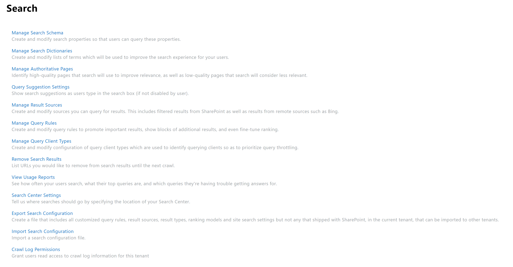
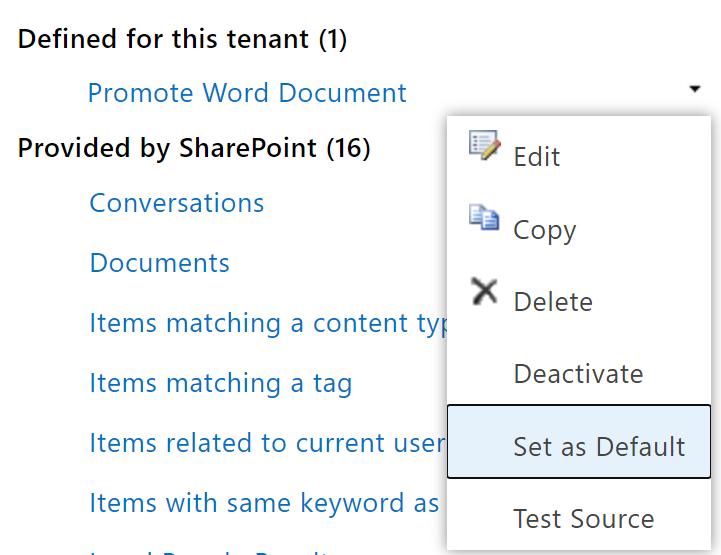
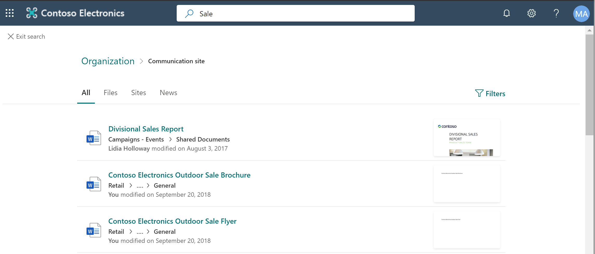
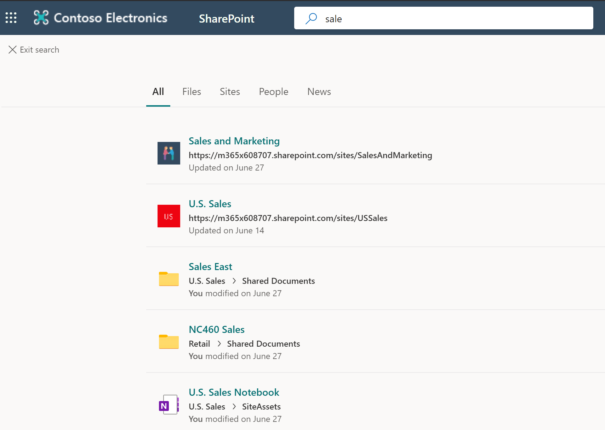

# Module 06-Lab 1: Configure Search

## Microsoft 365 user interface 

Given the dynamic nature of Microsoft cloud tools, you may experience user interface (UI) changes that were made following the development of this training content. This will manifest itself in UI changes that do not match up with the detailed instructions presented in this lab manual.

The Microsoft World-Wide Learning team will update this training course as soon as any such changes are brought to our attention. However, given the dynamic nature of cloud updates, you may run into UI changes before this training content is updated. **If this occurs, you will have to adapt to the changes and work through them in the lab exercises as needed.**

## Lab Scenario 

In the labs of this course you will create a new result source to be used in the tenant, alter the location of the search center, and provide reporting.

- **Exercise 1: Configure result source**

  - Task 1: Create a new result source
  - Task 2: Test the search result

- **Exercise 2: Monitor Search**

  - Task 1: Review Search usage reports

## Objectives

After you complete this lab, you will be able to:

  - Create a new result source

  - Export and review search usage reports

## Lab Setup 

  - **Estimated Time:** 40 minutes.

## Instructions

### Before you start

### 1. Review the lab virtual machines

The following is the virtual machine provided in this course. You will log in to the VM as a local administrator. The instructor will provide the sign-in information.

  - VM 1: a stand-alone Windows 10 client virtual machine with Office 2019 installed.

### 2. Review Microsoft 365 tenant

Once you launch the VM, a free trial tenant will be made available to you. The following are the details about the Microsoft 365 tenant:

  - Microsoft 365 E5.

  - 20 licenses and pre-assigned (20 assigned of 20 total).

  - One Global Administrator (MOD Administrator) and nineteen normal users have been pre-created.

  - Global Administrator (MOD Administrator) is **admin@YourTenant.onmicrosoft.com**.

**Note:** **YourTenant**.onmicrosoft.com is the domain associated with the Microsoft 365 tenant provided by the lab hosting provider. **YourTenant** is the unique tenant ID and different to each student.

## Exercise 1: Configure result source

In this exercise you will use the SharePoint Admin Center to create a new result source to be used in your tenant. To perform the tasks, you need the default tenant global admin account.

### Task 1: Create a new result source 

1.  Log on to **LON-CL1** virtual machine as the local administrator (Adatum\\administrator).

2.  Open **Edge** and browse to SharePoint admin center (https://\<YourTenant\>-admin.sharepoint.com) with your Microsoft 365 admin credential.

3.  In the left navigation pane, select **More features**.

4.  In the More features page, select **Open** under **Search.** You will now be on the Search management page.

    

5.  Select **Manage Result Sources.**

6.  Select **New Result Source** from the ribbon menu.

7.  In the new window, fill out the following information and select **Save** to create a new result source.

    - **Name:** Promote Word Document

    - **Query Transform:** {searchTerms} XRANK(cb=100) FileType:docx

    - Leave other settings as default.

8.  In the result sources page, select the dropdown menu of the **Promote Word Document** result source.

9.  Select **Set as Default** in the prompt window.

    

You have successfully created a new result source which promotes the word document to the top of the search result.

### Task 2: Test the search result

1.  Log on to **LON-CL1** virtual machine as the local administrator (Adatum\\administrator).

2.  Open **Edge** and browse to the SharePoint start page () with your Microsoft 365 admin credential.

3.  Type **Sale** in the top search box and select **Enter.**

4.  Notice the top of the search results are word files.

    

5.  Browse back to SharePoint admin center ().

6.  In the left navigation pane, select **More features**.

7.  In the More features page, select **Open** under **Search.** You will now be on the Search management page.

8.  Select **Manage Result Sources.**

9.  select the dropdown menu of the **Local SharePoint Results** result source.

10. Select **Set as Default** in the prompt window.

11. Search the term **sale** in the search box in the SharePoint start page (). Notice the search results are mix file types.

    

## Exercise 2: **Monitor Search**

In this exercise you will access the search usage reports and download the report files so that they can be provided to other users and management. The request for reports is to show what people are searching for in the tenant.

### Task 1: Review Search usage reports

1.  Log on to **LON-CL1** virtual machine as the local administrator (Adatum\\administrator).

2.  Open **Edge** and browse to SharePoint admin center (https://\<YourTenant\>-admin.sharepoint.com) with your Microsoft 365 admin credential.

3.  In the left navigation pane, select **More features**.

4.  In the More features page, select **Open** under **Search.** You will now be on the Search management page.

5.  Select **View Usage Reports.**

6.  Select **Top Queries by Day** to download the search report.

7.  Open and review the search report.

*Reminder: The search reports are processed at daily basis, you might not see any data in the report.*

You have now successfully downloaded the search usage reports. You have finished this exercise.

END OF LAB
