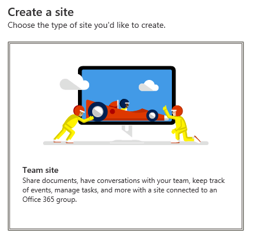
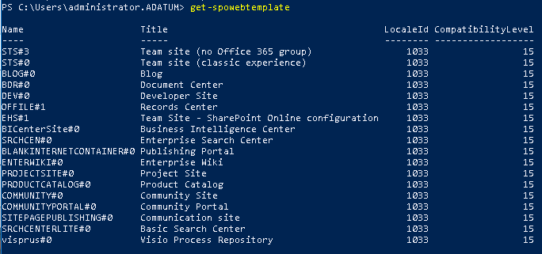
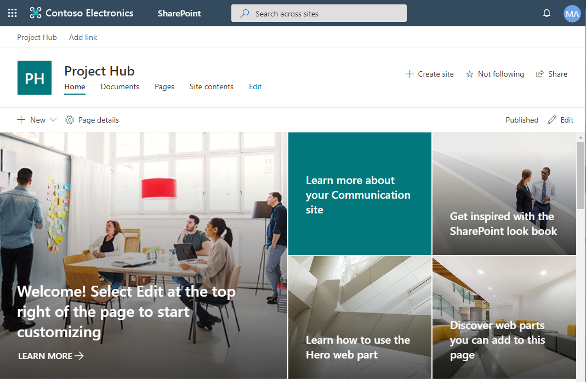
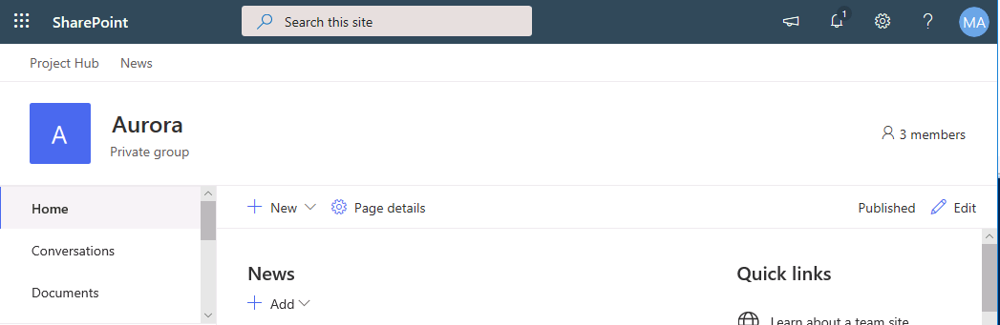

# Module 01-Lab 1: Configure SharePoint sites
## Microsoft 365 user interface 

Given the dynamic nature of Microsoft cloud tools, you may experience user interface (UI) changes that were made following the development of this training content. This will manifest itself in UI changes that do not match up with the detailed instructions presented in this lab manual.

The Microsoft World-Wide Learning team will update this training course as soon as any such changes are brought to our attention. However, given the dynamic nature of cloud updates, you may run into UI changes before this training content is updated. **If this occurs, you will have to adapt to the changes and work through them in the lab exercises as needed.**

## Lab Scenario 

You are the SharePoint Administrator for Adatum Corporation. The company built a new project business unit and requested to provision associated sites. In this lab, you will create new SharePoint sites and associate the site to a hub site.

- **Exercise 1: Create SharePoint sites**

    - Task 1: Create a team site from a browser
    - Task 2: Create a communication site from PowerShell

- **Exercise 2: Configure a hub site**
  - Task 1: Register the site as a hub site
  - Task 2: Design the hub site
  - Task 3: Associates a site with the hub site

## Objectives

After you complete this lab, you will be able to:

  - Create new SharePoint sites using browser

  - Create new SharePoint sites using PowerShell

  - Configure hub site for SharePoint sites

## Lab Setup 

  - **Estimated Time:** 25 minutes.

## Instructions
## Before you start

### 1. Review the lab virtual machines

The following is the virtual machine provided in this course. You will log in to the VM as a local administrator. The instructor will provide the sign-in information.

  - VM 1: a stand-alone Windows 10 client virtual machine with Office 2019 installed.

### 2. Review Microsoft 365 tenant

Once you launch the VM, a free trial tenant will be made available to you. The following are the details about the Microsoft 365 tenant:

  - Microsoft 365 E5.

  - 20 licenses and pre-assigned (20 assigned of 20 total).

  - One Global Administrator (MOD Administrator) and nineteen normal users have been pre-created.

  - Global Administrator (MOD Administrator) is **admin@YourTenant.onmicrosoft.com**.

**Note:** **YourTenant**.onmicrosoft.com is the domain associated with the Microsoft 365 tenant provided by the lab hosting provider. **YourTenant** is the unique tenant ID and different to each student.

## Exercise 1: Create SharePoint sites

### Task 1: Create a team site from a browser

In this task you will create a new SharePoint team site for a new project team named Aurora. The team site will associate with a Microsoft 365 group.

1.  Log on to **LON-CL1** virtual machine as the local administrator (Adatum\\administrator).

2.  Open **Edge** and browse to <https://portal.office.com>.

3.  Sign in to Microsoft 365
    
      - You should be presented a sign in dialog box, if you are directed to the page instead, select **Sign In** from the upper right of the page. If you are presented the sign in dialog box, **copy and paste the M365 Credential Username** into the box presented, select **Next**.
    
      - In the next screen, **copy and paste the M365 Credential Password** into the box presented, select **Sign In**.
    
      - When it asks if you would like to **Stay signed in?** then select **Yes** to stay signed in.

4.  In the Microsoft 365 landing page, select **Admin** to access **Microsoft 365 admin center.**

5.  In the Microsoft 365 admin center, select **Show all** in the left pane, and select **SharePoint** to access **SharePoint admin center.**

6.  In the SharePoint admin center, expand **Sites,** and select **Active sites.**

7.  Select **+Create** from the menu in the middle pane.

8.  Select **Team site** in the new window.

    

9.  Fill out the following site information and select **Finish** to complete the site creation.
    
      - **Site name**: Aurora
    
      - **Site owner**: Alex Wibler, Admin
    
      - **Site members**: Vicky Abbott, Jon Friday
    
      - **Language**: English
    
      - **Privacy settings**: Private
    
      - **Site description**: This is the site for the new project team -Aurora.

You have now created a new team site: <https://YourTenant.sharepoint.com/sites/Aurora>.

### Task 2: Create a communication site from PowerShell

In this task you will install, check, and use SharePoint Online Management Shell module to create a new SharePoint communication site to become the hub site for the new project business unit hosting latest news and information for the unit.

1.  Log on to **LON-CL1** virtual machine as the local administrator (Adatum\\administrator).

2.  Open **Edge** and browse to [SharePoint Online Management Shell module](https://www.microsoft.com/en-us/download/details.aspx?id=35588) **download page.**

3.  Select **Download** and choose x64 version to install the module. .

4.  Accept the agreement and follow the installation process.

5.  Open **Windows PowerShell.**

6.  Connect to **SharePoint Online Service** by running the following command in the PowerShell window. Please replace the **YourTenant** to the one you have. Enter the password while got prompt for credential.

    ```powershell
    $adminUPN="admin@<YourTenant>.onmicrosoft.com"
    $orgName="<YourTenant>"
    $userCredential = Get-Credential -UserName $adminUPN -Message "Type the password."
    Connect-SPOService -Url https://$orgName-admin.sharepoint.com -Credential $userCredential 
    ```


7.  Run the following command to view the available site template. From the output, we know the name for the communication site is SITEPAGEPUBLISHING\#0.

    ```powershell
    Get-SPOWebTemplate
    ```
    

8.  Run the following command to create a new communication site named Project Hub with Admin@\<YourTenamt\>.onmicrosoft.com as the site owner.

    ```powershell
    New-SPOSite -Url https://<YourTenant>.sharepoint.com/sites/ProjectHub -Owner admin@<YourTenant>.onmicrosoft.com -Title "Project Hub" -StorageQuota 10 -Template SITEPAGEPUBLISHING#0 
    ```

You have now created a new team site: <https://YourTenant.sharepoint.com/sites/ProjectHub>.

## Exercise 2: Configure a hub site 

### Task 1: Register the site as a hub site 

1.  Log on to **LON-CL1** virtual machine as the local administrator (Adatum\\administrator).

2.  Open **Edge** and browse to SharePoint admin center (https://\<YourTenant\>-admin.sharepoint.com) with your Microsoft 365 admin credential.

3.  Expand **Sites** and select **Active sites.**

4.  Select the Project Hub site (https://YourTenant.sharepoint.com/sites/ProjectHub).

5.  Select **Hub,** and then select **Register as hub site** from the dropdown menu.

6.  Enter the following information in the new window, and select **Save.**

    - Hub name: Project Hub
    - People who can associate sites with this hub: Admin@\<YourTenamt\>.onmicrosoft.com.

 You can also use the following command to achieve the same goal.

```powershell
Register-SPOHubSite https://<YourTenant>.sharepoint.com/sites/ProjectHub 
```

### Task 2: Design the hub site 

1.  **Open Edge** and browse to the Project Hub site (<https://YourTenant.sharepoint.com/sites/ProjectHub>) , you should see the hub navigation bar at the top of the page.

    

2.  **Select Add link and fill out following information, then Save.**

    - Address: https://\<YourTenant\>.sharepoint.com/sites/News
    - Display name: News

You can see the new link shows up at the hub navigation bar.

### Task 3: Associates a site with the hub site

1.  Log on to **LON-CL1** virtual machine as the local administrator (Adatum\\administrator).

2.  Open **Edge** and browse to SharePoint admin center (https://\<YourTenant\>-admin.sharepoint.com) with your Microsoft 365 admin credential.

3.  Expand **Sites** and select **Active sites.**

4.  Select the Aurora team site (<https://YourTenant.sharepoint.com/sites/Aurora>).

5.  Select **Hub,** and then select **Associate with a hub** from the dropdown menu.

6.  In the **Edit hub association** window, select **Project Hub** in the dropdown menu and **Save.**

7.  Browse to **Aurora team site**, you can see the hub navigation bar shows up at the top of the page.

    

You can also use the following command to achieve the same goal.

```powershell
Add-SPOHubSiteAssociation https://YourTenant.sharepoint.com/sites/Aurora -HubSite https://YourTenant.sharepoint.com/sites/ProjectHub 
```

END OF LAB
